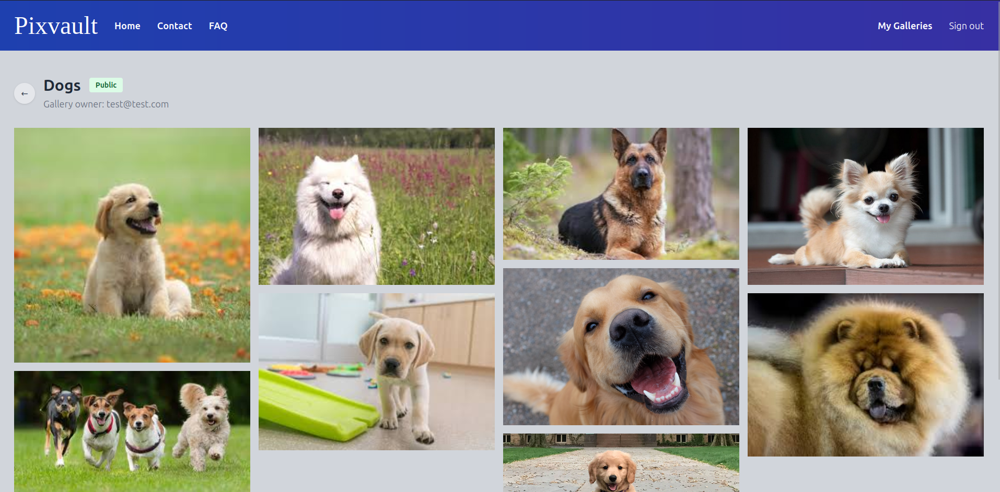
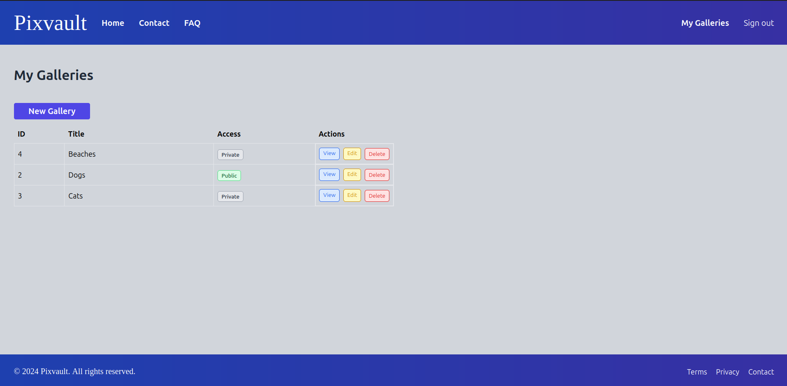
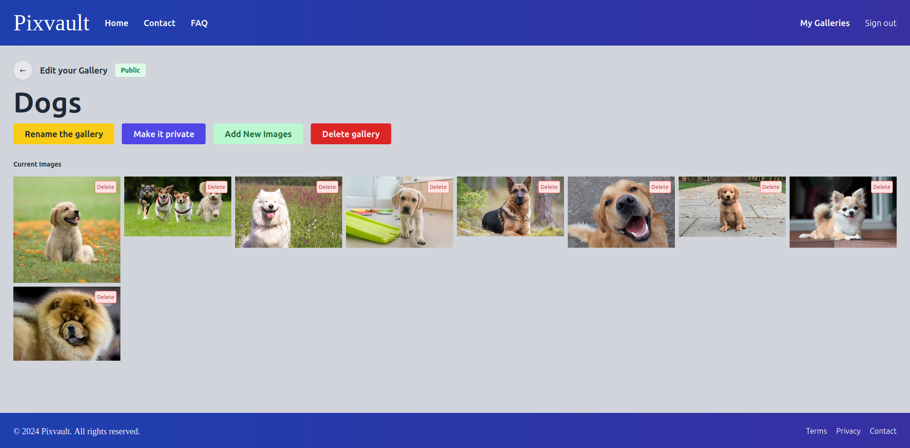
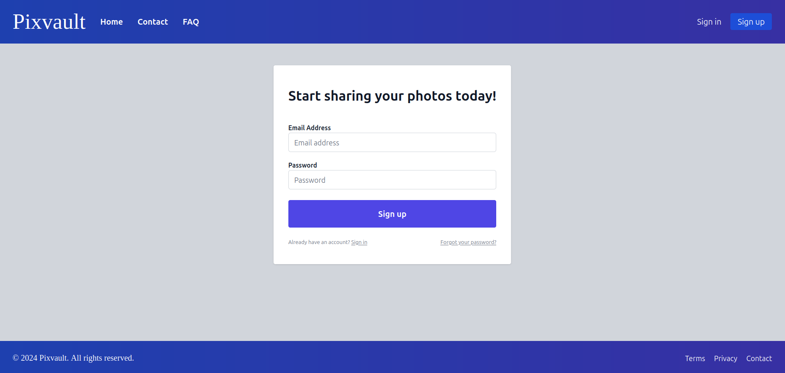
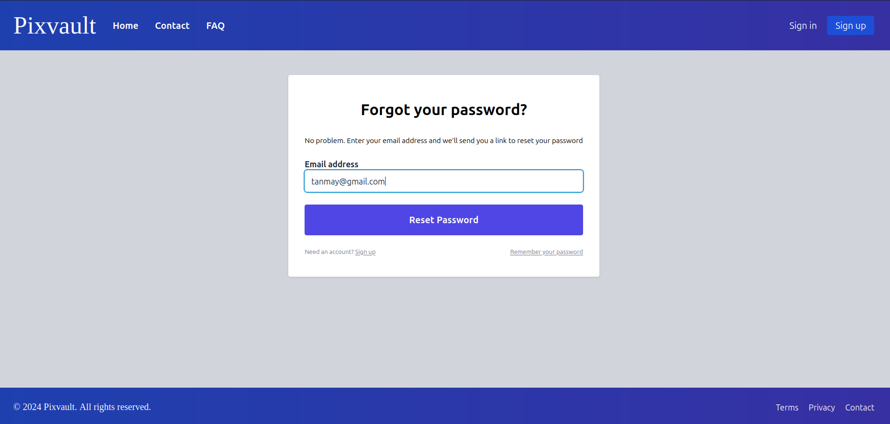
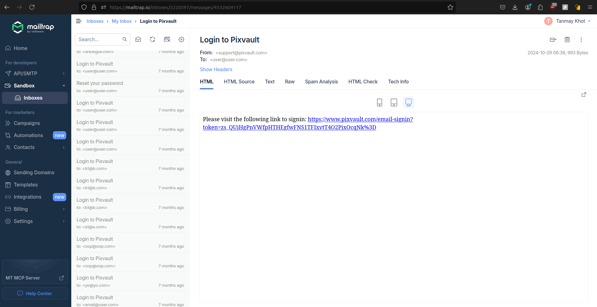

# Pixvault

Pixvault is a photo storage and management application inspired by Google Photos. <br>
This app allows users to upload, organize, and view their photos in a streamlined and user-friendly interface.
Built this app from scratch, without vibe coding

## Features

### Authentication & Security
- Email/password authentication with secure session management
- Password reset via email
- Email-based sign-in with token verification
- CSRF protection on all forms
- Secure password hashing with bcrypt

### Gallery & Photo Management
- Create, edit, and delete galleries
- Upload multiple images (JPG, PNG, JPEG, GIF)
- Organize photos into galleries
- Toggle gallery privacy (public/private)
- Delete individual images
- View images in gallery format

## Tech Stack

- **Backend**: Go
- **Frontend**: HTML, Tailwind CSS
- **Database**: PostgreSQL
- **Email**: SMTP
- **Containerization**: Docker
- **Development**: Docker Compose, Adminer (DB management)

## Setup

1. Copy `.env.template` to `.env` and configure:
   - Database settings (PSQL_*)
   - SMTP settings
   - CSRF key
   - Server address

2. Run with Docker:
```bash
# Development
docker compose up

# Production
docker compose -f docker-compose.yml -f docker-compose.production.yml up
```

## Deployment

The application is deployed on Digital Ocean using the following setup:

### Server Configuration
- Ubuntu 22.04 LTS
- Docker and Docker Compose installed
- PostgreSQL database

### Deployment Steps
1. Create a Digital Ocean droplet
2. Install Docker and Docker Compose
3. Clone the repository
4. Configure environment variables
5. Build and run containers

## Screenshots

### Gallery Interface

*Main gallery view showing photo collections*

### Gallery Management

*Gallery management options and controls*

### Edit Gallery

*Interface for editing gallery details and managing images*

### User Authentication

*User registration interface*

### Password Management

*Password reset request form*


*Password reset link sent to email*

## Project Structure

```
pixvault/
├── assets/          # Static assets
├── cmd/            # Command-line applications
├── controllers/    # HTTP request handlers
├── migrations/     # Database migrations
├── models/         # Database models
├── templates/      # HTML templates
├── views/          # View logic
└── tailwind/       # Tailwind CSS configuration
```

## Architecture

PixVault follows the Model-View-Controller (MVC) pattern:

### Models (`/models`)
- Database models and business logic
- Handles data validation and database operations
- Services for users, galleries, sessions, and email
- Database migrations and schema management

### Views (`/views` and `/templates`)
- HTML templates with Tailwind CSS styling
- View logic for rendering templates
- Error handling and user feedback
- CSRF protection and form rendering

### Controllers (`/controllers`)
- HTTP request handlers
- User authentication and session management
- Gallery and image operations
- Email service integration
- Middleware for security and user context

